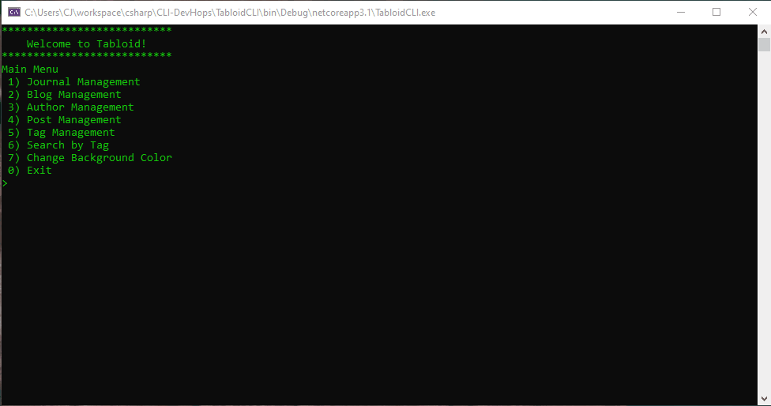
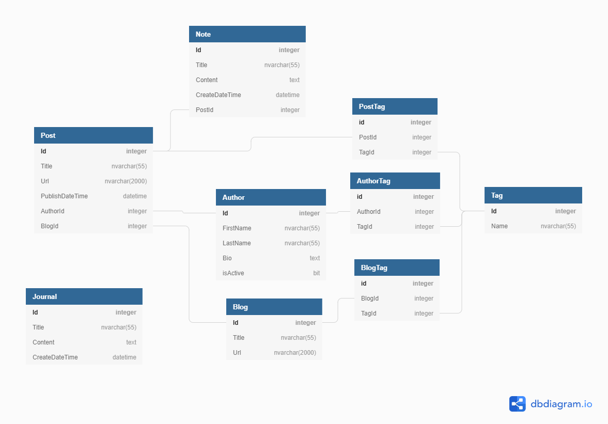

# Tabloid CLI

TabloidCLI is a command line interface that helps people manage their favorite blogs, authors, blog posts, journals, and tags.  People can add posts to blogs and add notes to posts.  This CLI was built by Rick Blake, Cornelia Johnson, and Brady Logan.

## Technologies & Skills Used:
C#/.NET Core, Visual Studio, SQL, SQL Server, ADO.NET, LINQ, Git, and GitHub

## Setup: Follow these steps
1. Clone this repository
2. `cd` into the new directory "cli-devhops"
3. Open in visual studio
4. Run sql query to create database (make sure to connect to local server)
5. Make sure you are in solution view and run the program

## Entity Relationship Diagram

